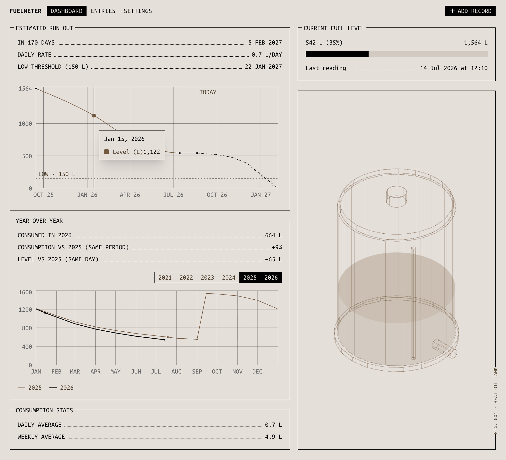

# Fuelmeter

Know how much diesel is left in the tank, and when it'll run out.



## Problem space

Up in the mountains I heat the house and the water with a diesel tank, and the
tank has no gauge. You check it with a dip-stick, get a reading in centimetres,
and then guess whether you'll make it through winter.

So I built Fuelmeter. I log the reading, it converts to litres off the
manufacturer's calibration table, and it tells me roughly when I'll run out. The
bit I'm weirdly proud of is the forecast: a flat rate lies, because I burn way
more in January than in May, so it learns the seasonal pattern from my own
history instead of averaging.

It's deeply boring to anyone but me, and I check it constantly.

## What it does

You log a dip-stick reading in centimetres and mark it as a refill if it was one.
Everything else is derived from that.

- Centimetres become litres against the manufacturer's calibration table
  (`lib/tank-lookup.ts`, 1 to 110 cm over a full tank of 1564 L), interpolated for
  decimal values.
- The dashboard shows the current level, the estimated run-out date with a
  confidence band, a year-over-year comparison of the same day across seasons, and
  daily/weekly consumption averages.
- Entries lists every reading so you can fix or delete a bad one. Settings holds
  the tank capacity and the low threshold.
- The whole thing sits behind a single-user login, since it's my tank.

## How the forecast works

The predictor (`lib/predictions.ts`) finds the current fill cycle (the readings
since the last refill) and estimates a consumption rate with OLS linear regression
over that segment, which holds up better than endpoint-to-endpoint when a single
reading is noisy. Just after a refill, when the segment is short, that rate is
blended with your historical average so early predictions aren't wild.

On top of that it derives 12 monthly seasonal weights from all of your history, so
the projection burns fuel faster in winter and slower in summer instead of assuming
a constant rate. The spread between segments becomes a ±1σ confidence band around
the forecast line.

## Tech stack

Next.js 16 on the App Router with React 19, Tailwind v4 and shadcn/ui on base-ui
primitives, SQLite through Turso/libSQL, Recharts for the charts and date-fns for
the date maths. Pages are client components calling Server Actions in
`lib/actions.ts` for every read and write, and the database client is server-only.

## Running it

Requires [pnpm](https://pnpm.io/).

```bash
# 1. Configure environment
cp .env.local.example .env.local
# The DB URL is preset for local dev (TURSO_DATABASE_URL=file:./local.db).
# Fill in AUTH_USERNAME and AUTH_PASSWORD for the login, plus a long random
# AUTH_SECRET to sign the session cookie. The app throws without them.

# 2. Install dependencies
pnpm install

# 3. Create and seed the local database
pnpm db:reset

# 4. Start the dev server
pnpm dev
```

Open [http://localhost:3000](http://localhost:3000).

Other useful commands:

```bash
pnpm build         # production build (type-checks first)
pnpm tsc --noEmit  # type-check only
pnpm db:reset      # drop tables, replay db/schema.sql, load db/seed.sql
```

See [`CLAUDE.md`](./CLAUDE.md) for architecture notes, the full prediction model,
and Turso + Vercel setup.
